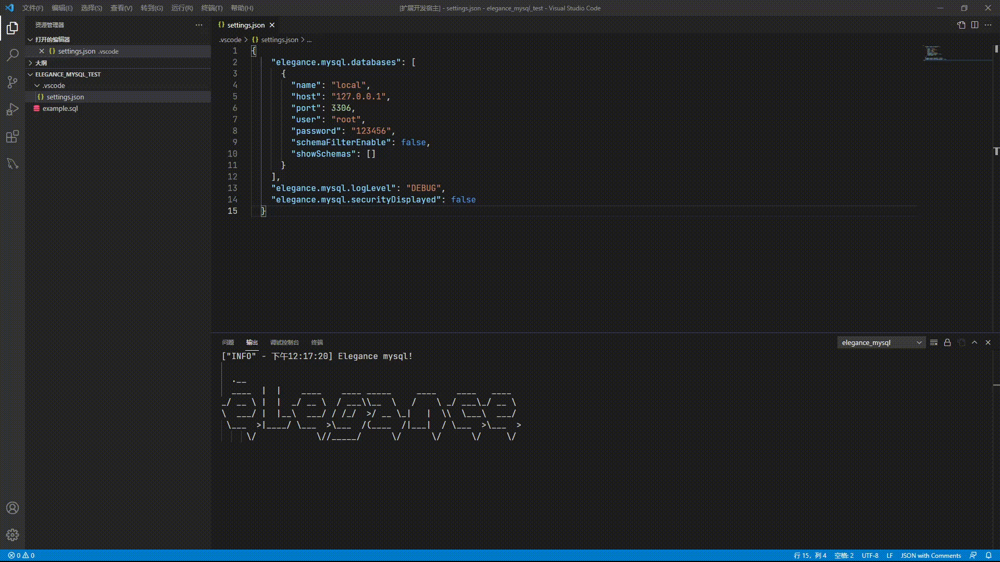

# elegancemysql README

[](https://open.vscode.dev/AethLi/elegance_mysql)
[](https://github.com/AethLi/elegance_mysql/blob/main/LICENSE)

## Features

1. Easy to configure database connection.
2. Execute simple query with a mouse operation.
3. Execute sql anywhere.
   - run "database select" command
   - select sql for execute
   - run "run selected sql"



> ATTENSION:
>
> Other extensions can get configuration for eleganc_mysql.
> if there is any malicious extension,
> it will leak database connection information from settings.json.

## Compatible target

MySql 5.7.X, MySql 8.X

## Extension Settings

- elegance.mysql.databases:

```json
{
  "name": "local",
  "host": "127.0.0.1",
  "port": 3306,
  "user": "root",
  "password": "mysqlpassword",
  "schemaFilterEnable": false,
  "showSchemas": []
}
```

elegance_mysql view shows databases of settings(global settings/workspace settings)

other settings:

```json
{
  "elegance.mysql.logLevel": "DEBUG", //log level for elegance_mysql extension.
  "elegance.mysql.securityDisplayed": false //show a known security issue when this extension startup.
}
```

## Known Issues

1. Add database button doesn't take effect.
2. CompareTo doesn't take effect.
3. Query slowly in some case.

## Version Plan

1. Complete sql language support for mysql.
2. Complete all installed button or menus.
3. Add page support for result webview.
4. Complete language switch support.
5. Complete beginner's guide.

**Enjoy!**
